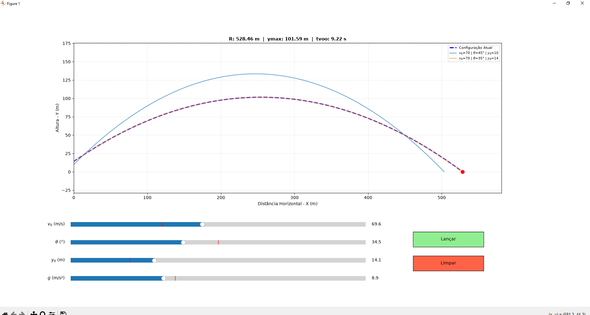

# 🚀 Simulador Interativo de Lançamento de Projéteis

Trabalho acadêmico desenvolvido para a disciplina de **Física - Práticas Extensivas**, sob a orientação do **Prof. Dr. Ettore Baldini-Neto**. 

Este projeto consiste em um software interativo com interface gráfica (GUI) que permite simular e analisar o comportamento do lançamento oblíquo em condições ideais (sem resistência do ar), aplicando soluções analíticas fechadas calculadas em tempo real.

---

## 📸 Demonstração da Interface



---

## 🎯 Critérios do Projeto Atendidos

### 1. Correção Física dos Cálculos (Peso: 25%)
O algoritmo utiliza estritamente soluções analíticas fechadas obtidas em aula, sem a necessidade de integração numérica aproximada.
*   **Posição Horizontal:** $x(t) = x_0 + v_0 \cos \theta \cdot t$
*   **Posição Vertical:** $y(t) = y_0 + v_0 \sin \theta \cdot t - \frac{1}{2}gt^2$
*   **Tempo de Voo:** $t_{voo} = \frac{v_0 \sin \theta + \sqrt{(v_0 \sin \theta)^2 + 2gy_0}}{g}$
*   **Altura Máxima:** $y_{max} = y_0 + \frac{(v_0 \sin \theta)^2}{2g}$
*   **Alcance Horizontal:** $R = x_0 + v_0 \cos \theta \cdot t_{voo}$

### 2. Interface Gráfica e Responsividade (Peso: 25%)
*   **Controles Implementados (Sliders):** Ajuste fino de velocidade inicial ($v_0$: 5 a 150 m/s), ângulo ($\theta$: 1° a 89°), altura inicial ($y_0$: 0 a 50 m) e aceleração da gravidade ($g$: 1,6 a 24,8 m/s²).
*   **Atualização em Tempo Real:** O gráfico da parábola e as caixas de exibição numérica do cabeçalho são atualizados instantaneamente quando o usuário move os seletores, sem travar ou demandar reinicialização.
*   **Visual sem Distorções:** Proporção matemática geométrica de 1:1 mantida ativamente nos eixos cartesianos ($X$ e $Y$) para evitar deformações na representação real da física do projétil.

### 3. Animação Dinâmica (Peso: 15%)
*   Inclusão do botão **"Lançar"** que inicia a animação temporal do projétil (ponto físico móvel) percorrendo fielmente a trajetória da curva calculada pelas equações horárias do movimento.

### 4. Tratamento de Entradas Inválidas (Peso: 10%)
*   Interface blindada nativamente por meio de limites impostos via hardware pelos sliders. Essa abordagem impede a inserção de strings vazias, velocidades negativas ou divisões por zero, tornando o sistema amigável e à prova de falhas.

### 5. Pontuação Extra (Requisito Opcional)
*   **Sistema de Sobreposição:** O programa retém o histórico dos disparos anteriores sempre que o botão de lançamento é ativado. Isso possibilita a comparação visual simultânea e direta do efeito de variações físicas na mesma área de plotagem.

---

## 🛠️ Requisitos e Organização Técnica

O software foi construído na linguagem **Python 3** e está estruturado em funções bem definidas e documentadas, separando completamente a física analítica das interações e renderizações gráficas:
*   `calcular_resultados()`: Resolve as equações do movimento ideal.
*   `calcular_trajetoria()`: Gera o conjunto de matrizes temporais de posição através da biblioteca `numpy`.
*   `atualizar_grafico()`: Captura os eventos disparados pelos sliders e atualiza o Canvas.

---

## ⚙️ Como Executar a Aplicação

1. Clone o repositório em seu ambiente local:
   ```bash
   git clone https://github.com/gustavfreitas/pi_fisica_extensiva
   cd pi_fisica_extensiva
   ```

2. Certifique-se de instalar as dependências necessárias através do gerenciador de pacotes:
   ```bash
    import numpy as np
    import matplotlib.pyplot as plt
    from matplotlib.widgets import Slider, Button
    import matplotlib.animation as animation
    from matplotlib.animation import FuncAnimation
   ```

3. Execute o script principal:
   ```bash
   python disparo_projetil.py
   ```

---

## 📊 Relatório Técnico: Caso de Teste Homologado

Parâmetros de entrada testados para validação analítica do sistema:
*   **Velocidade Inicial ($v_0$):** $50.0 \text{ m/s}$
*   **Ângulo de Lançamento ($\theta$):** $45.0^\circ$
*   **Altura Inicial ($y_0$):** $10.0 \text{ m}$
*   **Gravidade Corrente ($g$):** $9.81 \text{ m/s}^2$ (Padrão Terrestre)

**Resultados Numéricos Apresentados:**
*   **Tempo de Voo ($t_{voo}$):** $7.47 \text{ s}$
*   **Altura Máxima ($y_{max}$):** $73.71 \text{ m}$
*   **Alcance Horizontal Máximo ($R$):** $264.05 \text{ m}$

---

## 👥 Contribuintes e Integrantes do Grupo
*   **Gustavo Freitas** - [#](https://github.com/gustavfreitas)
*   **Pedro Canute** - [#](https://github.com/pedrocanute)
*   **Miguel Akira** - [#](https://github.com/miguelhakira)
*   **Thiago Oliete** - [#](https://github.com/Thiago-Oliete)

---
